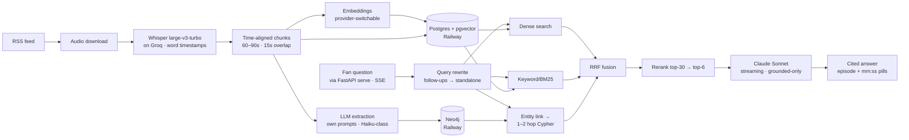

# Architecture

Backcat system design — written day 3, before any pipeline code. Decisions with rationale live in `docs/DECISIONS.md`; acceptance targets in the product vault. Figures in `[brackets]` are estimates to validate against reality (days 4/8/10).

## System overview

## Stack (decided day 3)

| Layer | Choice | Notes |
|---|---|---|
| Web | Next.js + TypeScript on Vercel | Landing shipped day 2 |
| Query API | **FastAPI** (`serve/`) on Railway | Runs the whole query path; SSE streamed **direct to the browser** (single CORS origin, no Vercel hop) |
| Auth | **Keycloak** (Docker locally, committed realm export; Railway when the panel goes public) + Auth.js in web | Roles `admin/creator/fan`; pulled forward from v1.0 (day-4 decision); provider swappable behind the Auth.js seam |
| Pipeline + eval | **Python** (≥3.10) | AI-ecosystem tooling; eval harness open-sources credibly |
| ASR | Whisper large-v3-turbo on Groq | ~$0.04/audio-hour, word timestamps |
| Embeddings | **Provider-switchable:** OpenAI `text-embedding-3-small` (default) ↔ self-hosted `bge-m3` (fallback) | See abstraction below |
| Vector + relational | Postgres + pgvector on **Railway** | Waitlist stays on Supabase for now |
| Graph | Neo4j (community image) on **Railway**, Docker locally | We own memory/volumes/backups |
| Extraction LLM | **Own prompts** + Haiku-class hosted model, structured output | Prompts are IP → open-sourced day 14. Gemma 4 = week-2 cost-down candidate |
| Answering LLM | **Claude Sonnet**, streaming, prompt caching | Grounded-only; citation discipline is the product |
| Reranker | Cohere or bge cross-encoder | Final pick day 10, decided by golden-set numbers |
| Retrieval glue | `neo4j-graphrag-python` retrievers where they save code | **Not** its extraction pipeline — schema + prompt ownership |
| Orchestration | Plain Python CLIs + job state in Postgres | No queue framework during the sprint; status page reads job rows |
| Repo | One monorepo `backcat`: `web/` `serve/` `pipeline/` `eval/` `docs/` | Landing moves in; Vercel re-pointed |

## 1. Ingestion

RSS URL → parse feed (episode GUID dedupe, enclosure redirects) → download audio → batched Whisper on Groq → store transcript JSON (words + timestamps) in Postgres. Every job writes a row (`queued → transcribing → chunking → embedding → graphing → live`) with per-episode cost and duration logged — this is both the status page's data and the public cost posts' source. Jobs retry with attempt counts; exhausted jobs land in a `failed` terminal state — the job table *is* the dead-letter queue.

## 2. Indexing

Chunks are **time windows, not character counts**: 30–45s with 10s overlap (config-driven via `app_config`; shortened from 60–90s so a player seeked to chunk start lands within the ±15s precision bar), aligned to word boundaries; each chunk carries `(catalog_id, episode_id, start_ts, end_ts, text)`. Full-text (tsvector) + dense embedding per chunk.

**Idempotency** (day-3 decision): chunk IDs are deterministic — `hash(episode_id, start_ts)` — and every pipeline write is an upsert (Postgres `ON CONFLICT`, Neo4j `MERGE`). Re-runs and re-index on demand never duplicate rows or nodes; any stage can be safely repeated per catalog.

**Embedding provider abstraction** (day-3 decision): an `Embedder` interface with two implementations (OpenAI, bge-m3). Consequences we accept:

- Vectors from different models are **not comparable** — a switch means re-embedding the catalog (re-index on demand is the mechanism). Cost is cents per catalog, so this is fine.
- Every embedding row stores `model` + dimension; the pgvector column/index is per-model (1536 for 3-small, 1024 for bge-m3). Queries embed with the catalog's *active* model only.
- Switch is **per-catalog config**, editable in the minimal admin panel from day 4 (DB-backed `app_config`, DB → env precedence); the full creator-facing admin panel remains v1.0. bge-m3 also hedges vendor outage and unlocks multilingual catalogs later.

## 3. Graph schema (provenance-first)

Nodes: `Concept · Person · Resource · Episode · Chunk`.
Edges: `MENTIONS · RECOMMENDS · RELATES_TO · PART_OF` — **every edge carries `(episode_id, start_ts)`**. No provenance, no edge.

Extraction: one structured-output pass per chunk with our own prompt → typed entities, relations, one-line claim summary. Batched, cached, cost logged. Then alias canonicalization (embedding-similarity candidates + LLM tie-break, merges logged and reversible) before Neo4j load. Community clustering (Leiden/Louvain) assigns theme clusters (day 12).

## 4. Query path

1. Rewrite follow-ups into standalone queries (chat history)
2. Three channels in parallel: dense (pgvector) · BM25 (tsvector) · graph (entity link → 1–2 hop Cypher → connected chunks + claims)
3. RRF fusion → cross-encoder rerank top-30 → top-6
4. Claude Sonnet, streaming, grounded-only: every claim cites `[episode, mm:ss]`; low confidence → honest-absence response, question logged to the gap system

Targets: first token ≤ [3.5]s p50 · citation within ±[15]s · hit@5 ≥ [0.85] on the golden set.

### Serving (day-3 decision)

The whole query path runs in a **FastAPI service (`serve/`) on Railway** — same runtime as the Python retrieval stack, so no glue rewrite. The browser talks to it **directly over SSE** (single CORS origin); Next.js never proxies the stream, so no Vercel function timeout/streaming hop. Per-IP rate limiting lives here (counter in Postgres — no Redis) plus a **global daily spend kill-switch** for the public demo: an unauthenticated endpoint that calls Sonnet needs a budget fuse, not just per-IP limits.

**App tables** (Postgres, `catalog_id` on each, defined day 1 so day 11–12 doesn't improvise them): `sessions` · `messages` · `questions` (asked + `unanswered` flag — feeds gap nodes and the v1.0 gap report) · `guardrail_events` · `app_config` (key/value; **DB → env fallback** precedence — spend caps, kill-switch, model switches; edited in the admin panel, read by pipeline + serve + web).

**Concept map serving:** the explorer reads a **precomputed JSON snapshot per catalog** (built after graphing + clustering, CDN-cached) — never live Neo4j queries per visitor. Cheaper, meets the ≤[3]s render bar, and the public share page stays up even if Neo4j hiccups.

## 5. Guardrails

Grounded-only generation (answers restricted to retrieved chunks) · prompt-injection neutralization on questions · safe refusals in product voice · rate limiting per IP/session · every guardrail event logged to `guardrail_events`. Honest absence is a feature, not a failure state.

## 6. Cost model (per 100h catalog, `[brackets]` = validate day 4/8)

| Stage | Est. | Basis |
|---|---|---|
| Whisper (Groq) | ~$[4] | $0.04/audio-hour |
| Extraction (Haiku-class, own prompts) | ~$[3] | one pass over ~[10k] chunks, cached |
| Embeddings (3-small) | <$[1] | ~$0.02/1M tokens |
| **Ingest total** | **~$[8]** | one-time per catalog |
| Answering (Sonnet, top-6 chunks, prompt caching) | ~$[0.008]/q | ceiling $[0.02]/q; semantic cache (v1.0) is the margin lever |

## 7. Deployment & environments

- **Local dev:** Docker Compose — Postgres+pgvector, Neo4j. Pipeline CLIs run against it.
- **Prod:** Vercel (web) · Railway (Postgres, Neo4j, FastAPI serve, pipeline workers) · Groq/OpenAI/Anthropic APIs.
- Railway Neo4j is self-managed: volume for data, memory caps set, weekly dump to object storage before launch week. (AuraDB Free remains the zero-ops fallback if Railway ops eat sprint time.)
- Nightly `pg_dump` of Postgres to the same object storage — transcripts are the most expensive artifact to regenerate; the graph can be rebuilt from them, not vice versa.
- Two data platforms exist right now (Supabase holds the waitlist, Railway holds the product). Fine for the sprint; consolidate or don't after day 30.

## Deliberately deferred

Multi-catalog schema is in from day 1 (`catalog_id` on every table/node — cheap now, painful later), but multi-*tenant* auth/orgs, semantic cache, diarization, and incremental sync wait for v1.0+. Reranker vendor decided by day-10 numbers, not preference.
